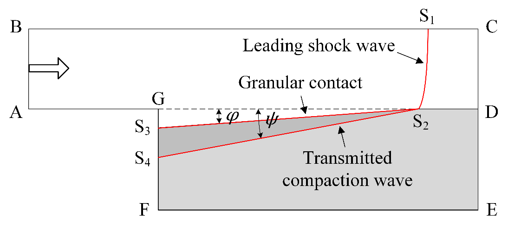
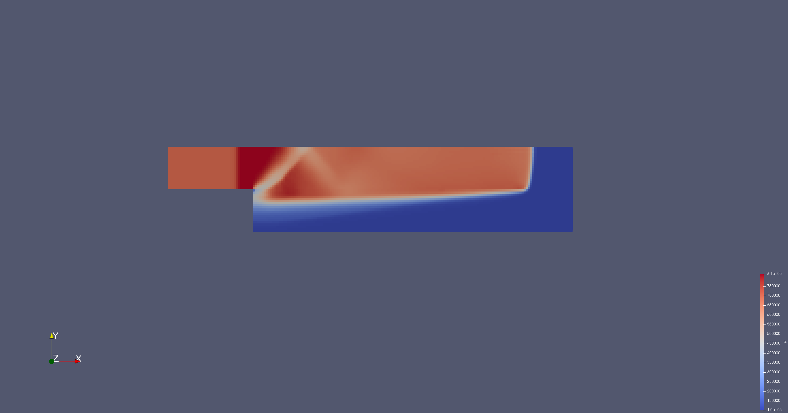
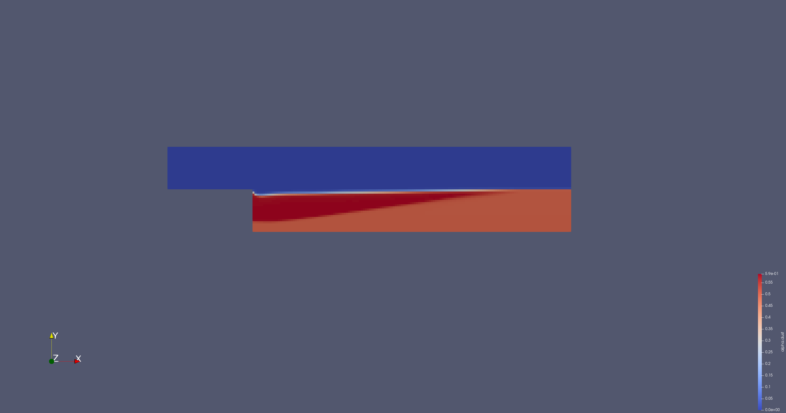

*Аннотация*: В статье представлено численное моделирование взаимодействия
ударной волны с пылевым слоем на основе модели Баера-Нунциато с применением
пакета blastFOAM в среде OpenFOAM. Рассмотрены динамические процессы деформации
и компактирования частиц, вызванные распространением ударной волны. Проведён
анализ распределения давления и объёмной доли частиц, а также зависимости
характеристик компактирования от скорости волны. Результаты моделирования
подтверждены сравнением с экспериментальными данными и опубликованными
исследованиями, что демонстрирует адекватность выбранной модели для описания
многофазных ударно-волновых процессов.

*Ключевые слова*: МОДЕЛЬ БАЕРА-НУНЦИАТО, УДАРНАЯ ВОЛНА, OPENFOAM

# Введение

Задачи, связанные с исследованием распространения ударных волн, часто возникают
в различных областях науки и техники: при проектировании двигателей внутреннего
сгорания, в военных технологиях, а также при моделировании опасных ситуаций,
случающихся на производствах, таких как пылевой взрыв [@chuprov_gunpowder].
Пылевой взрыв --- это опасное событие при работе с химически активными
порошками (например, угольной, алюминиевой пылью, мукой). Он начинается с
начального взрыва-инициатора (например, взрыв метана в шахте), который создает
ударную волну. Эта волна разрыхляет пыль, взвешивает частицы в воздухе, вызывая
их возгорание и усиление взрыва. Основными эффектами, возникающими при
взаимодействии ударной волны с пылевым слоем являются диспергирование частиц
над пылевым слоем и деформация слоя [@chuprov_mfs]. 

Для математического моделирования ударно-волновых процессов с учетом эффектов
диспергирования частиц и деформации слоя традиционно используются модели,
основанные на лагранжевом описании среды. Однако, имеются определенные
трудности при большом перемещении и сильной деформации среды, что привело к
разработке методов на основе эйлерово-лагранжевой модели, реализованных в таких
программных пакетах, как Alegra [@alegra] и BLAST [@blast].  Тем не менее эти
методы сложны для технической реализации в случаях, когда в модели присутствуют
гранулированные среды. Поэтому для моделирования различных задач многофазных
сред все чаще используются эйлеровы модели, такие как модель Баера-Нунциато
[@Baer]. 

Одним из программных пакетов для решения задач гидродинамики является
программный пакет OpenFOAM с открытым исходным кодом [@openFOAM], основанный на
решении уравнения Навье-Стокса методом контрольного объема.
Для моделирования высокоскоростных течений в пакете реализован стандартный
решатель `rhoCentralFoam`. Конвективные потоки рассчитываются по схеме
Курганова-Тадмора, которая проявляет излишние диссипативные свойства при
решении, но позволяет избежать решения задачи Римана на каждой итерации [@Chun_2013]
При расчёте учитывается только одна компонента флюида, что ограничивает его
использование в задачах моделирования взаимодействия газообразной и дисперсной
фазы. Существует программный пакет blastFOAM [@blastfoam], разработанный на
основе пакета openFOAM, для решения уравнений Эйлера методом контрольного
объёма для многокомпонентных сжимаемых течений с учётом детонации.

В настоящей статье рассматривается использование пакета blastFOAM для
моделирования взаимодействия ударной волны с засыпкой частиц по модели Баера-Нунциато.
Анализируются результаты численного моделирования посредством сравнения
термодинамических параметров решения с результатами, представленными в статье
[@chuprov_mfs].

# Математическая модель

Модель Баера-Нунциато для двух фаз без релаксационных слагаемых может быть записана как система уравнений, состоящая из 
уравнения компактирования 
$$
	\frac{\partial \alpha_k}{\partial t} + \mathbold{U}_I \cdot \nabla \alpha_k = 0,
$$ {#eq:compaction} уравнения сохранения массы
$$
	\frac{\partial \alpha_k \rho_k}{\partial t} + \nabla \cdot (\alpha_k \rho_k \mathbold{u}_k)  = 0,
$$ {#eq:masscons} уравнения сохранения импульса
$$
	\frac{\partial\alpha_\mathrm{k}\rho_\mathrm{k}\mathbold{u}_\mathrm{k}}{\partial t}+\nabla\cdot\left(\alpha_\mathrm{k}\rho_\mathrm{k}\mathbold{u}_\mathrm{k}\otimes\boldsymbol{u}_\mathrm{k}\right)+\nabla\left(\alpha_\mathrm{k}P_\mathrm{k}\right)-P_I\nabla\alpha_k=0,
$$ {#eq:momentumcons} уравнения сохранения энергии 
$$
\frac{\partial\alpha_\mathrm{k}\rho_\mathrm{k}E_\mathrm{k}}{\partial t}+\nabla\boldsymbol{\cdot}\left(\alpha_\mathrm{k}\left(\rho_\mathrm{k}E_\mathrm{k}+P_\mathrm{k}\right)\boldsymbol{u}_\mathrm{k}\right)-P_I\boldsymbol{u}_I\nabla\alpha_k=0
$$ {#eq:energycons}
для каждой фазы с индексом $k=1,2$ [@preprAlexeev]. 
Здесь $\alpha_k$, $\rho_k$, $\mathbold{u}_k$, $P_k$, $E_k$ --- объёмная доля,
плотность, скорость, статическое давление и полная энергия.
В системе уравнений $\mathbold{u}_I$ и $P_I$ --- скорость и давление на
межфазных границах. Выражения для $\mathbold{u}_I$ и $P_I$ выбираются в
зависимости от взаимодействующих фаз. 
Полная энергия фазы $k$ равна $E_k = \mathbb{U}_k + \frac{\mathbold{u}_k^2}{2}$, где $\mathbb{U}_k = \mathbb{U}_k (P_k,\rho_k)$ --- внутренняя энергия, определяемая уравнением состояния.
В качестве уравнения состояния для каждой из фаз  используется уравнение состояния жёсткого газа (stiffened-gas equation of state): 
$$
	\mathbb{U}_k = \frac{P_k+\gamma P_0}{\rho (\gamma -1 )}
$$ {#eq:stgaseos}
Корреляции для расчёта межфазного обмена импульсом приведены в статье [@Houim_2016].

# Результаты вычислительных экспериментов
Постановка задачи основана на эксперименте, описанном в [@Fan_2006].

{#fig:scheme}

На [@fig:scheme] представлена схема расчетной области. 
Через грань AB в область входит ударная волна, проходящая сначала
над твердым уступом AG, после чего взаимодействует с частицами в области GDEF. На всех остальных гранях
используется граничное условие проскальзывания. В начальный момент времени внутри
расчетной области в каждой точке скорости обеих фаз равны нулю, давления равны атмосферному.

{#fig:pressure}

{#fig:alpha}

На [@fig:pressure; @fig:alpha] представлены значения полей давления газа и объемной доли частиц в момент времени 
$2\cdot10^{-4}$&nbsp;с. На рисунках видно, что по мере распространения ударной волны слой деформируется и образуется зона компактирования частиц.
Также на [@fig:pressure] можно наблюдать краевые эффекты от угла уступа AGF и отражение ударной волны от дна канала. 

Рассмотрим зависимость углов $\phi$ и $\psi$ (изображены на [@fig:scheme]) зоны компактирования дисперсной среды от скорости ударной волны.
Для этого рассмотрим значения углов при начальных скоростях волны $u_1 = 700$&nbsp;м/с и  $u_2 = 1400$&nbsp;м/с. При начальной скорости $u = u_1$ углы принимают значения $\phi = 1.17^{\circ}$ и $\psi = 7.36^{\circ}$.
При увеличении скорости прохождения глубина слоя компактирования становится меньше: при начальной скорости $u=u_2$ углы $\phi = 1.21^{\circ}$,$\psi = 7.21^{\circ}$. 
Результаты, полученные в численном эксперименте, соответствуют результатам расчетов, представленным в [@chuprov_mfs] и результатам экспериментов, описанным в [@Houim_2016].
Это подтверждает корректность выбранного подхода и адекватность модели
Баера-Нунциато для описания сложных процессов взаимодействия ударной волны с
пылевым слоем.

# Заключение
В настоящей работе продемонстрирована возможность численного моделирования взаимодействия ударной волны со частицами дисперсной фазы по модели Баера-Нунциато в среде openFOAM.
Продемонстрировано экспериментально наблюдаемое явление формирования под поверхностью слоя частиц области, препятствующей распространению деформации вдоль слоя. 

Вычислительные эксперименты подтвердили адекватность модели Баера-Нунциато для
описания процессов взаимодействия ударной волны с пылевым слоем. Полученные
результаты хорошо согласуются с экспериментальными данными и публикациями, что
подтверждает корректность выбранного подхода.

Использование решателя blastFOAM в среде OpenFOAM показало
перспективность для решения задач мультифазной гидродинамики с учетом сложных
явлений диспергирования и деформации. В дальнейшем планируется расширение
модели за счет учета релаксационных процессов и взаимодействий на микроуровне,
что улучшит точность и применимость к реальным промышленным ситуациям.

# Библиографический список 
